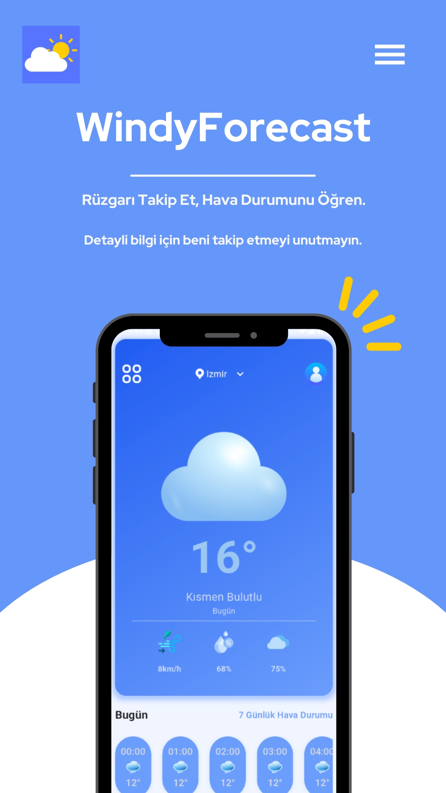

# ☁️ WindyForecast Hava Durumu Uygulaması

Bu uygulama, kullanıcılara anlık ve 7 günlük hava durumu tahminleri sunan modern bir hava durumu uygulamasıdır. Konum bazlı hava durumu takibi, şehir ve ilçe seçimi gibi özellikleri sayesinde kullanıcıların anlık hava koşullarını hızlıca öğrenmesini sağlar.

# 🌐 Temel Özellikler

- Konum Tabanlı Hava Durumu: Uygulama açıldığında, kullanıcının bulunduğu konumu algılayarak hava durumu bilgilerini gösterir.
- Şehir ve İlçe Seçimi: Kullanıcılar istedikleri şehir ve ilçeyi seçerek o bölgedeki hava durumu verilerini görüntüleyebilir.
- Saatlik Hava Durumu Tahmini: Her saat için ayrı ayrı sıcaklık, nem oranı ve rüzgar hızı gibi veriler sunulmaktadır.
- 7 Günlük Hava Durumu: Kullanıcılar bir haftalık hava durumu tahminlerini inceleyebilir.
- Rüzgar Hızı ve Nem Bilgisi: Anlık rüzgar hızı, nem oranı ve hava durumu koşulları detaylı olarak gösterilir.

#🚀 Gelecek Güncellemeler
-Hava durumu bildirimleri
-Karanlık mod desteği
-Daha fazla detaylı grafikler

#Geliştirici
- Uygulama Geliştiricisi **Mertroot** [Mertroot'un LinkedIn Profili](https://www.linkedin.com/in/mertbacara/)

